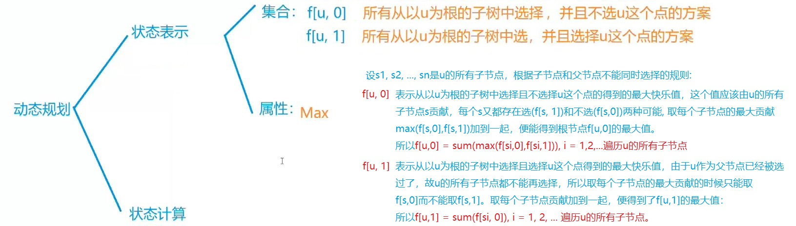
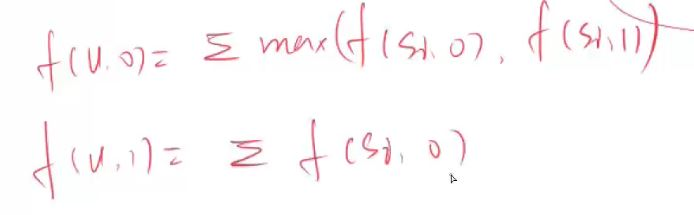

# 没有上司的舞会

本题的动态规划思考图:

分析见上图。

时间复杂度，其实就是遍历树得所有边。树的边的数目应该等于节点数目-1。所以时间复杂度为O(n)。

# 有依赖的背包问题

1. 特点：

有依赖的背包问题，是把物品组织成一棵树，选择某个物品i的前提是要把它的根节点也选择上去。这样类型的问题一个典型的场景是选课。
假如一个大学生要选课，所有的课构成n个物品，这些课都有课时（物品重量）和学分（物品价值）两个属性。一个大学生在一学期能上的课时有限(背包容量有限)。
课程和课程之间可能存在先修的关系。比如高等数学是矩阵论的先修课，就是说如果选了矩阵论，就必须也选择高等数学。问在这种情况下学生应该怎样选课能使得
本学期所得的学分最多。
这个问题被成为有依赖的背包问题。

2. 思路:

定义状态举证f[N][N]。f[u][j]表示在节点u的子树中选择，体积不超过j的时候得到的最大价值。设v表示物体的体积数组， v[u]表示节点u物体的体积。w表示物体的价值数组, ..., 
看雪菜视频吧...:

有依赖的背包问题最后划归为分组背包问题+树形DP 
