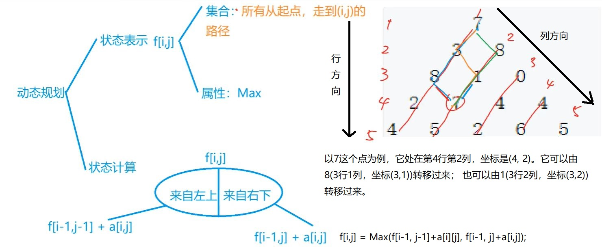

# 记忆化搜索
## 数字三角形


1. 保存数组三角形<br>
可以使用二维矩阵保存数字三角形。保存时的三角形如下所示<br>
10<br>
-6<br>
-4 -5<br>
-3 7 5<br>
 3 7 -2 1<br>
再使用一个同等大小的状态矩阵f[][]来做记录<br>
初始化代码:
```
        //初始状态置为负无穷
        //注意在置初始状态的时候，初始的状态一定要比实际矩阵的大小大一圈，以便处理边界情况。
        //下面是将所有的f都初始化为负无穷
        for (int[] k : f)
            Arrays.fill(k, INF);

        //也可以按照输入三角形的大小来初始化f矩阵
/*        for(int i = 0; i<=n+1; i++){
            for(int j = 0; j <= i+1; j++)
                f[i][j] = INF;

                注意在这种情况下，f状态矩阵的初始化的范围要比arr三角形要大一圈，以处理边界情况。
                在f的初始化中， i 和 j是从0开始初始化的，且终止条件是i<=n+1和j<=i+1;
                而下面的arr三角形的读入中, i 和 j是从1开始的，且终止条件是i<=n和j<=i;
        }*/

        Scanner sc = new Scanner(System.in);
        n = sc.nextInt();
        for (int i = 1; i <= n; i++) {
            for (int j = 1; j <= i; j++) {
                arr[i][j] = sc.nextInt();
            }
        }
```
2. 状态转移方程
```
f[i][j] = Math.max(f[i-1][j-1]+arr[i][j], f[i-1][j]+arr[i][j]);
```
3. top-down 的计算方式和 bottom-up的计算方式
top-down 计算状态的代码
```
  int dp_top_down() {
        f[1][1] = arr[1][1];
        for (int i = 2; i <= n; i++) {
            for (int j = 1; j <= i; j++)
                f[i][j] = Math.max(f[i-1][j-1]+arr[i][j], f[i-1][j]+arr[i][j]);//状态转移方程
        }

        int res = INF;
        //最长路径的终点一定出现在三角形最底下一层，因此遍历最底下一层的f[i][j]找出最大的f[i][j]
        for(int i = 1; i<=n; i++)
            res = Math.max(res, f[n][i]);
        return res;
    }
```
 * 从状态的计算过程看，这个解法是从f[1][1]开始计算，使用之前的f, 从上往下依次计算每个f[i][j]。
 * 这也是所谓的top-down(自顶向下)的计算方法。因为最长的结果有可能出现在最后一层的任意一个节点，所以最后需要遍历f[n][i]来找到符合要求的那一个。
 * 本题如果采用自底向上的计算方式，则最后直接返回f[1][1]就能得到最终结果。

bottom-up 计算状态的代码
```
/*
    * 从底向上计算每个状态，最终的结果保存在f[1][1]中，无需遍历。
    * */
    int dp_bottom_up(){
        //首先要将最底层的所有f[n][i]都初始化为arr[n][i]
        for(int i = 1; i<=n; i++)
            f[n][i] = arr[n][i];

        //从倒数第二层开始依次往上层计算f[i][j]
        for (int i = n-1; i >= 1; i--) {
            for (int j = 1; j <= i; j++)
                f[i][j] = Math.max(f[i+1][j+1]+arr[i][j], f[i+1][j]+arr[i][j]);//状态转移方程
        }
        //最终的结果保存在f[1][1],省却了上面方法还需要搜索的烦恼
        return f[1][1];
    }
```

4. 在求最长路径值的同时，如何将最长路径保存下来?


动态规划问题的时间复杂度一般使用如下公式计算:
```
时间复杂度 = 状态数量*转移计算量
```
这个问题的状态数量是n<sup>2</sup>, 转移计算量是O(1)。
总的时间复杂度是O(n<sup>2</sup>) 
