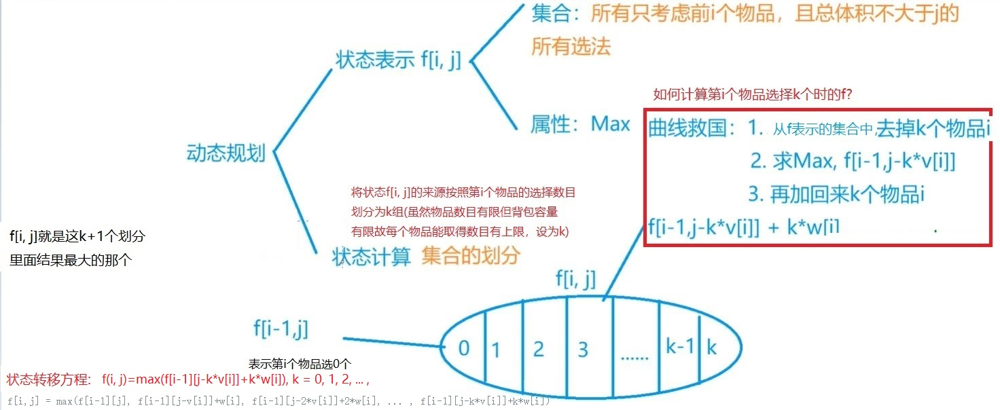
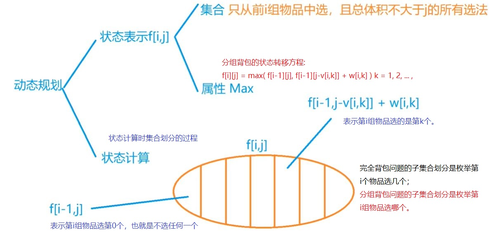

>所有的背包问题都是先对物品循环，再对体积循环，再对决策循环

# 背包问题
背包问题的优化就是代码的等价变形或者状态计算公式的等价变形。
## 01背包问题
1. 特点: 每种物品只有一个，所以每种物品最多用一次。

从集合的角度思考这个问题


2. 解法:<br>
状态计算公式：
```
f[i][j] = max(f[i-1][j], f[i-1][j-v[i]]+w[i])
```
相应的代码:
```
for (int i = 1; i <= n; i++) {
            for (int j = 0; j <= m; j++) {
               f[i][j] = f[i-1][j];
               if(j>=v[i]) f[i][j] = Math.max(f[i][j],f[i-1][j-v[i]]+w[i]);
            }
        }
  return f[n][m];
```
3. 优化为1维矩阵


如上图所示，如果我们要计算红色部分的f(i,j), 根据状态计算公式f(i,j) = Math.max(f(i-1, j),f(i-1, j-v<sub>i</sub>)+w<sub>i</sub>)。
其中f(i-1, j)就是上一层的蓝色块，而f(i-1, j-v<sub>i</sub>)就是上一层的粉色块。由此可知，计算本层的某一个f(i,j)的时候，只需要用到上一层
的这两个位置的元素。所以可以采用滚动数组的形式来保存上一层的状态，只需要一维的数组。

转为一维数组需要在原来的代码上做等价变形，我们删去矩阵的一个维度，并将内层的循环顺序改为j由大到小的循环。
```
int dfs_1D(){
        for (int i = 1; i <= n; i++) {
            for (int j = m; j >= v[i]; j--) {
                g[j] = Math.max(g[j],g[j-v[i]]+w[i]);
            }
        }
    return g[m];
    }
```
至于为什么要将内层的循环顺序改为由大到小:
如下图所示，转为一维矩阵时，我们计算f[j] = Math.max(f[j], f[j-v<sub>i</sub>]+w<sub>i</sub>)。如果我们从左边往右边
更新这个矩阵，由于j-v<sub>i</sub><j, 所以在更新f[j]的时候，f[j-v<sub>i</sub>]已经在这次的外循环中被更新过了。然后而由上面的二维矩阵
分析可知，实际上我们更新f[j]所需要的那个f[j-v<sub>i</sub>]，是上一层循环中的f[j-v<sub>i</sub>]。
如果我们把更新一维矩阵的方向改为从右往左，则在更新f[j]的时候，f[j-v<sub>i</sub>]还没有被更新，这样我们取到的这个f[j-v<sub>i</sub>]就还是
上一层的f[j-v<sub>i</sub>]，这样我们的代码就相当于对二维的代码做了等价变形。


## 完全背包问题
1. 特点: 每种物品有无限个, 只要装的下就可以装任意多个。
2. 解法

从集合的角度思考这个问题:



状态转移方程:
```
f[i,j] = max(f[i-1][j], f[i-1][j-v[i]]+w[i], f[i-1][j-2*v[i]]+2*w[i], ... , f[i-1][j-k*v[i]]+k*w[i])
       = max(f[i-1][j-k*v[i]]+k*w[i]), k = 0,1,2,...,
```
```
for (int i = 1; i <= n; i++) {
            for (int j = 0; j <= m; j++) {
                //状态转移方程f[i,j] = max(f[i-1][j], f[i-1][j-v[i]]+w[i], f[i-1][j-2*v[i]]+2*w[i], ... , f[i-1][j-k*v[i]]+k*w[i])
                //对k循环实现上面的这个方程
                for (int k = 0; k * v[i] <= j; k++)
                    f[i][j] = Math.max(f[i][j], f[i - 1][j - k * v[i]] + k * w[i]);
            }
        }
        return f[n][m];
```
3. 优化

可以看出上面解法中为了找出f[i][j]的k个子状态中的最大值，我们友加入了一层循环，导致存在三重循环，算法的复杂度很高。
优化的过程如下:


经过优化，状态转移方程变为了:
```
f[i,j] = max(f[i-1][j],f[i][j-v[i]]+w[i])
```
这样我们就可以省去一重循环:
```
for (int i = 1; i <= n; i++) {
            for (int j = 0; j <= m; j++) {
                f[i][j] = f[i - 1][j];
                if (j >= v[i])
                    f[i][j] = Math.max(f[i][j], f[i][j - v[i]] + w[i]);
            }
        }
  return f[n][m];
```
进一步的，我们可以对比一下01背包问题的状态转移方程和完全背包问题的状态转移方程:
01背包:
```
f[i][j] = max(f[i-1][j], f[i-1][j-v[i]]+w[i])
```
完全背包问题:
```
f[i][j] = max(f[i-1][j],f[i][j-v[i]]+w[i])
```
可以发现, 01背包问题的第二个状态f[i-1][j-v[i]]是第i-1的f[j-v[i]]，所以在转化为一维数组时，我们要求更新f[j]数组要从右往左更新，这样才能保证使用的f[j-v[i]]是第i-1层的数据。

而完全背包问题的第二个状态f[i][j-v[i]]是第i层的f[j-v[i]]，因此在转为一维数组的过程中，我们更新f[j]时使用的就是本层的已经被更新过的f[j-v[i]], 要达到这个目的，只需对f[j]数组从左往右更新即可。

- 对比01背包问题的代码和完全背包问题最终优化版的代码:

01背包问题代码：
```
int dfs_1D(){
        for (int i = 1; i <= n; i++) {
            for (int j = m; j >= v[i]; j--) {
                g[j] = Math.max(g[j],g[j-v[i]]+w[i]);
            }
        }
        return g[m];
 }
 ```
完全背包问题代码：
```
int dfs_best(){
        for(int i = 1; i<=n;i++){
            for(int j = v[i]; j<= m; j++)
                g[j] = Math.max(g[j],g[j-v[i]]+w[i]);
        }
        return g[m];
 }

``` 
可以发现两者的唯一区别就在于**第二层循环的更新一维数组的方向不同，一个是从右到左更新,一个是从左到右更新。其余代码完全相同。**

## 多重背包问题
1. 特点： 每种物品的个数用s<sub>i</sub>给定, 用完就不能再用了。
2. 解法:

多重背包问题与完全背包问题十分类似，区别仅仅在于完全背包问题的物品i的个数是无限个，选取第i个物品的个数仅仅受到有限的背包体积j的限制；
而多重背包问题的物品i是s[i]个，选取第i个物品的个数除了受背包体积的限制外，还受到s[i]的限制。

从集合出发思考多重背包问题:


状态转移方程:
```
f[i][j] = Math.max(f[i][j],f[i-1][j-k*v[i]]+k*w[i]);
```
由于多重背包问题的状态转移方程与完全背包问题非常类似，因此其朴素解法的代码也几乎一致:
```
for(int i = 1; i<=n; i++){
            for(int j = 0; j<= m; j++){
                //与完全背包稍微不同的是，因为物品i的数目最多为s[i]个，故此处对k的约束还要加上k<=s[i]
                for(int k = 0; k <= s[i] && k*v[i] <= j; k++)
                    f[i][j] = Math.max(f[i][j],f[i-1][j-k*v[i]]+k*w[i]);
            }
        }
 return f[n][m];
```
3. 多重背包的优化一:二进制优化
由于状态转移方程的相似性，我们似乎可以按照完全背包问题的推倒方式来优化多重背包问题的状态转移方程:


从上面的式子我们可以发现上下的等式之间不能简单的用f[i][j] = f[i][j-v] + w 来表示。
故用类似多重背包的优化方法行不通。我们需要另寻出路。

- 多重背包的二进制优化问题:
对于多重背包，我们上面朴素解法的第三重循环是对第i个物品可取的个数从k = 0到k = s[i]遍历，找出使得 f[i-1][j-k\*v[i]]+k\*w[i] 最大的k。

以s[i] = 15 为例，我们需要遍历k = 0, k = 1, k = 2, ... , k = 15这16种情况去找到最大值。
我们也可以换一个思路来思考这个遍历的过程，如果我们将这15个i号物品分为这样的4组:第1组1个i号物品，第2组2个i号物品，第3组4个i号物品，第4组8个i号物品。然后我们规定
每次在取i号物品的时候，从这i组里面取，每次要么不取某组物品，要么取该组所有物品。

而0，1，2，4，8 这5个数的0-1取舍组合，能够产生0~15之间任意的数字。对这四组物品做0-1取舍的操作，相当于遍历取k = 0~15。
这样就相当于这4组是4个新物品，我们对这4个新物品做0-1取舍。

这样我们就将多重背包问题划归为0-1背包问题，同时降低了时间复杂度，避免了三重循环。

如何将任意一个数字n划分为可以以0-1取舍方式拼凑出0~n的小组呢？

以n = 200为例:

我们的分组为: 1, 2, 4, 8, 16, 32, 64, <font color = red>73</font>

最后一个数字73 = 200 - 前面所有数字的和。 

前7个数字1~64可以0-1取舍拼凑出1~127中的任意一个数字，将1~127 + 73, 可以拼凑出128~200中的任意一个数字。

对于任意一个数字n, 我们的分组方式如下:
2<sup>0</sup>, 2<sup>1</sup>, ... , 2<sup>k</sup>, n-2<sup>k+1</sup> 

2<sup>k+1</sup> 是最接近n但不大于n的2的幂次方的数。

算法思路：
  1. 将S个物品拆分成logS个
  2. 对这logS个物品做0-1背包
  总的时间复杂度由NVS降低为NVlogS
 假设N=1000, V=2000, S=2000,
 则NVS的做法会超出C++每秒1亿次的运算， NVlogS约等于2\*10<sup>7</sup>。
 
 这里我们采取一种新的存储策略，我们直接将输入的物品进行分组，分完的组直接存入v、w数组进行保存。

**二进制优化并不是多重背包问题最快的解法，最快的解法是使用单调队列优化**
4. 多重背包的优化二:单调队列优化 
代码参考自:https://www.acwing.com/solution/acwing/content/1537/

建议看雪菜B站背包九讲的视频
## 分组背包问题
1. 特点： 所有的物品分为若干组，每组中只能挑选一个物品放入背包。（比如水果组、蔬菜组等）
2. 解法:



注意状态转移条件和完全背包问题的对比:
- 完全背包问题的集合划分是枚举**第i个物品选多少个**
- 分组背包问题的集合划分是枚举**第i组物品选第几个**(选第0个表示不选第i组物品)
```
f[i][j] = Math.max(f[i-1][j-v[i,k]]+w[i,k]) k = 0,1,2, ... 表示第i组物品的第k个物品
```
## 混合背包问题
1. 特点：把0-1背包、完全背包和多重背包混合起来，物品一共有三类，第一类物品只能使用一次，第二类物品可以使用无限次，第三类物品最多只能使用s<sub>i</sub>次。求把这些物品装进一个空间有限的背包能获得的最大价值是多少。
2. 解法:

混合背包问题的解法就是综合前面0-1背包、完全背包、多重背包的解法。首先按照前面解决多重背包的二进制优化思路，只要在输入多重背包的物品的时候分好组，并将分到一组的物品看作是一个物品保存，然后按0-1背包问题处理即可。这样这个问题就划归为0-1背包和完全背包混合的问题。对0-1背包问题和完全背包问题，只要按照不同的更新方向更新一维数组就可以了。

## 二维费用的背包问题
1. 特点: 每个物品除了有体积大小v<sub>i</sub>,还有重量m<sub>i</sub>这一维度的属性。背包除了有空间的限制，还有最大承重的限制。在这些条件下，求能取到的物品的最大价值。
2. 解法:

一维限制的时候，我们使用一维状态数组:
f[j]表示体积不超过j时的最大价值；

自然而然的，再由两维限制的时候，我们使用二维数组来表示最大价值这一状态:
f[i][j]表示体积不超过i,重量不超过j的情况下的最大价值。

然后在更新状态矩阵的时候我们比一维限制加一层循环即可:
第一层循环 对1~n个物品进行循环，从前往后枚举每个物品， 每次表示第i个物品

第二层循环枚举体积，第三层循环枚举重量；
设共有N个物品，背包能容纳的体积为V, 能承受的重量为M, 则时间复杂度为O(NVM), 空间复杂度为O(VM)
