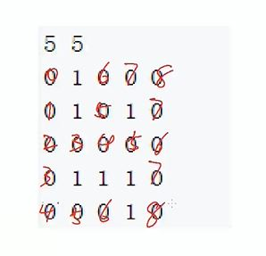
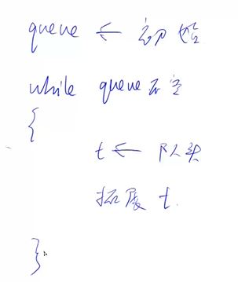

# 深度优先搜索
BFS的最主要的优势他可以搜到最短距离
## 走迷宫
宽搜本题找出口的步骤

一般而言宽搜的流程

本题的题解中使用了数组arr来模拟队列，实际上就是开一个空的数组，有两个指针hh和tt。hh指向队头，每次要从
队列中取元素的时候就取arr[hh], 然后将hh++将队头往后移动一位，表示队头元素已经取出，现在的新队头是hh+1;
往队列中存元素的时候就把元素保存在arr[tt]中，然后将tt++往后移动一位。一开始hh和tt都指向0。这个用数组模拟
出来的队列和用数组模拟出来的链表有一样的问题，就是被删除的元素的空间不能回收再使用。
## 走迷宫升级版