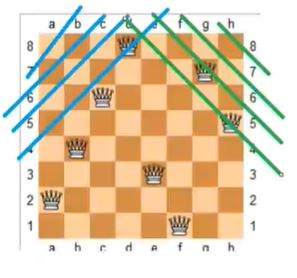

# 搜索与遍历
BFS_DFS对比，
宽度优先搜索和深度优先搜索其实针对树的遍历来说的，如果遍历的时候是沿着树的某一条
枝桠一直往下走，不走到头不回头，就是深度优先遍历（前序、中序、后序遍历都属于深度优先遍历，
只不过遍历的时候选的枝桠不一样）；而按层扩展，一层一层的搜索，就是宽度优先遍历。 
**当觉得DFS的问题不好想的时候，不妨按树的搜索模型来考虑问题**

## 深度优先搜索
### 排列数字
排列数字按树的深搜模型思考。
我们把排列数字的问题转换成搜索一棵树的问题来考虑，如下图所示。假设本题要排列的数位是3.
则我们有三个位置需要确定数字。u = 0 的第零层表示这三个位置没有还没有数字是确定的，这是搜索的
初始状态。u = 1的第一层表示从u = 0的状态下的子状态，表示第一位已经确定的三种情况，分别是第一位
等于1，2，3。这三种情况是u = 0的三个子状态。然后这三个子状态根据第二位的选择又有各自的子状态...:
这棵树生长下去，直到u = n的时候，第n位已经确定。这个时候每个叶子节点都是一个所有位置都确定的状态，
是排列数字的一种可能。这棵树的每一条从root到叶子节点的路径都是一个合法的排列结果。
需要特别关注的是，在因为排列的数字不能重复使用，因此在这个搜索树上，沿着一条路径往下，这条路径上方
使用过的数字在下方都不能再使用了。因此在确定上层某个位置的数字后，我们需要使用一个标记数组将这个数
字记录为上层已经用过，以让下面的状态知道这个数字不能再使用了。当下面的状态遍历寻找可用的数字的时候，
通过查看这个标记数组可以知道本层可以使用哪些数字，又有哪些数字本层不能再使用了(因此这些不能再使用
的数字再往下的所有状态也都不合法了，这从本层看就像是用剪子减去了以这些树为root的子树，减去了一些
不必要的“枝桠”，，因此这个操作被称为剪枝操作)

关键需要理解的是，我们在搜到头(到了叶子节点的时候)，如何回溯。假设我们现在已经到了第三层最左边的
状态，找到了123这样的一个排列，三个位置确定表示这已经是一个完全确定的状态，已经满足了记录的要求了。
直接return。 return之后我们回到了调用这一层的状态，也就是然后回溯到了上一层，这样我们就回到了它
的父节点12_这个状态。我们发现在这一层的时候，我们记录中的1,2,3都已经被使用了，那么我们继续往12_的
父节点回溯，同时我们应该恢复数字3已经使用的这个状态（恢复现场）。到了1__这一层，到了这一层，我们发现由于
刚才走过了12_这条路，将1，2标记为已使用，所以第2位数字还可以填3。因此我们找到了13_这个新的状态，再沿着
这个新的状态往下遍历即可。

### n皇后问题
1. 思路1

与搜索全排列的思路相同，枚举每一行皇后放到哪个位置上去。抽象成如下模型:
有n行， 每行可以放到某个位置上去，相当于有n个坑，第i个坑表示第i行，每个坑填一个不同的数字表示列数，这样这个问题就转化成了与
上面全排列的问题了: n个位置，放n个数字的全排列。

这样这个问题的搜索顺序与全排列一模一样了。还应用之前的的树形搜索模型，这样这个问题就变成第一层枚举第一行的皇后放在哪一列，
第二行枚举第二个皇后放在哪一列...,

只不过， 这里的传递到下一层状态的元素选取规则不再简单是上一层用过的元素这一层不能再用，而是和这个元素共列、共对角线
的元素都不能再选(由于是前面是按行枚举的，所以行不会重复)。所以需要开三个标记数组，分别用来标记第i列、第i个正对角线、
第i个斜对角线是否可用。(对角线如下图所示，蓝色代表正对角线，绿色代表反对角线，设棋盘是n\*n的大小，则正反对角线各有2\*n-1条)

其余的步骤就和全排列的规则一模一样了, 在dfs函数里面：
1. 如果递归到(u == n), 则找到一个合法的搜索路径（即合法的放置方法），输出这个放置；
2. 否则u<n, 枚举所有列，对其中合法的列(检查四个标记数组)，将本层的位置放置该列，并记录该列数字对应的四个标记数组为不可用，
然后递归进入下一层dfs(u+1);
3. 上一层的递归调用完毕出来后，回到了本层，要恢复现场，将在本层标记为不可用的四个标记数组重新标记为可用，
并结束本层回到本层的上一层也就是调用层。

其中第二步根据标记数组检查每个列是否可以放到本层这个位置的过程，被称为**剪枝**，这个词形象的来源于dfs的树搜索模型。因为对于
不符合检查数组的列，我们就在这个位置停止了它向下继续搜索，从树的搜索模型看就像剪去了这课搜索树的某个树枝。因此称为剪枝。

本题的难点除了抽象出dfs的步骤以外，还有一个就是定义四个标记数组，尤其是两个对角线数组怎么定义。

## 宽度优先搜索

## 树与图的存储

## 树与图的深度优先遍历

## 树与图的宽度优先遍历

## 拓扑排序