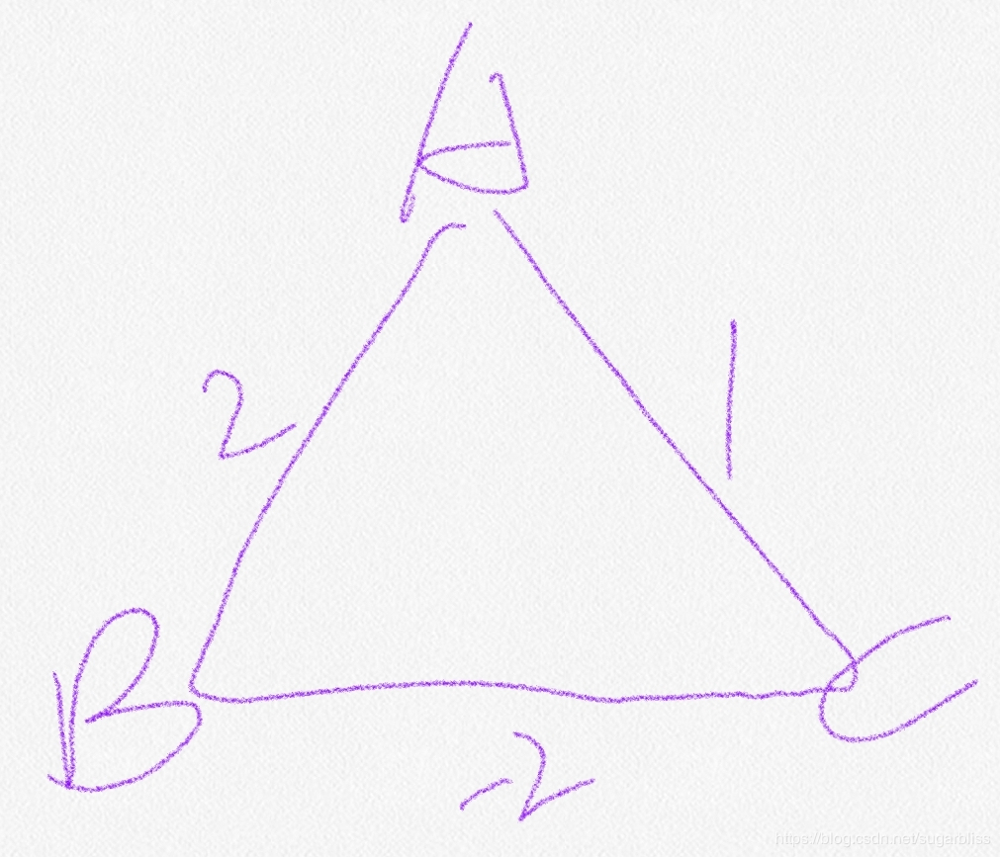
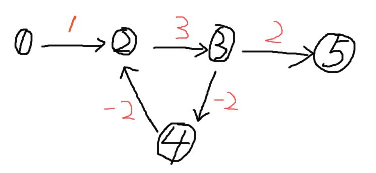

# 最短路算法
## 单源最短路
- 所有边权都是正数
  1. 朴素Dijkstra算法 。 时间复杂度O(n2), n表示节点个数, 适用于稠密图，即边的数目比较多，边的数目>=节点数目的平方。
  稠密图一般用邻接矩阵来保存。
  2. 堆优化版的Dijkstra算法。时间复杂度O(mlogn)，m表示边的数目,n表示节点数目。适用于稀疏图, 边的数目和节点数目一个级别。
  稀疏图一般用邻接表来保存。
  
  堆优化版本的Dijkstra算法是对朴素版本的Dijkstra算法的优化，在朴素版本的Dijkstra算法中，我们
  使用了双重循环，第一层循环从1-n, 然后在这重循环里面，我们需要每次从未确定最短路的节点里面找出dist最小的那个, 遍历查找这个
  值的操作是O(n),因此朴素Dijkstra算法的时间复杂度是O(n^2)。
  堆优化版本的Dijkstra算法对查找剩余节点中最短路径用堆做了优化，使得查找最小值的复杂度降低到了O(logm), m是边的数目。
  故堆优化版本的Dijkstra算法的时间复杂度为O(nlogm)。
  - 为什么Dijkstra算法不能用于由负权边的图？
  dijkstra是基于贪心策略，每次都找一个距源点最近的点，然后将该距离定为这个点到源点的最短路径；但如果存在负权边，那就有可能
  先通过并不是距源点最近的一个次优点，再通过这个负权边，使得路径之和更小，这样就出现了错误。对于下图将A添加到集合中标记已访问，
  之后选出从A到所有节点中的最短的点，于是把C加入集合中标记已访问，之后C不能在更新了，而显然，A与C之间最短路径权值为0（A-B-C）
  ，发生错误。
  
  
  
- 存在负权边
  - 对于图中有负权边的情况，有可能不存在最短路径。当图中存在负环的时候，有可能最短路径不存在。如下图所示:
  1号节点到5号节点的最短路径是负无穷，因为2、3、4构成了一个负环，从1到5的路径中可以在这个环里面转无限次，每转一次，
  最短路径都会减少1，这样可以一直减少到负无穷再出去到5。
  
  
  1. Bellman-Ford 算法。时间复杂度O(nm), n表示节点数量，m表示边的数量。本算法可以用来判断图中是否有负环, 但效率不够高。
 
 算法流程
 ``` 
  //循环所有点，复杂度O（n）
  for i = 1 ~n
  // 每次内循环访问所有边, 复杂度O(m)
    for 所有边 a,b,w     (表示从a到b有一条权重为w的边)
        dist[b] = Math.min(dist[b], dist[a] + w)
 ```
  2. SPFA(Shortest Path Faster Algorithm) 。一般情况下是O(m),最坏O(nm)。且本算法不适用于要求从A到B中间最少经过k个点的问题。本算法可以比较高效率的判断图中是否有负环存在。
  SPFA算法是对Bellman-Ford算法的一个优化。
 Bellman-Ford算法在第二重循环里面，每次都无脑的遍历所有的边。事实上，对于更新条件
  dist[b] = Math.min(dist[b], dist[a] + w)
  并不是每次更新都有效的，只有在之前的更新过程中dist[a]变小了，在本轮中的dist[b]才有可能会变小从而被更新。所以在每轮更新的时候，我们可以用一个队列记录本轮更新过程中有哪些节点的最短距离被更新，
  这样在下一轮更新的时候，只有这些点的出边有可能会被更新。
  ```
  SPFA算法步骤:
  queue <- 1
  while queue 不空
        1. t <- q.poll();
        2.更新t的所有出边， 并将发生更新的出边的点加入队列queue.
  ```
  
  - 一般来说SPFA算法的适用范围最广(边权可以为负)，且效率也比较高(平均O(m),最坏O(nm))。故一般的最短路问题可以直接使用SPFA算法。但在某些特殊的情况下，SPFA算法的时间复杂度(最坏O(nm))会高于
  堆优化版的Dijkstra算法(O(nlogm))。
  另外，如果要求最短路径最多经过k条边，则只能使用Bellman-Ford算法。
## 多源汇最短路
Floyd算法，复杂度O(n^3)
```
这些算法都是有向图算法。无向图可以看成特殊的有向图(A和B之间有一条A指向B的边，同时还有一条B指向A的边)。
```
