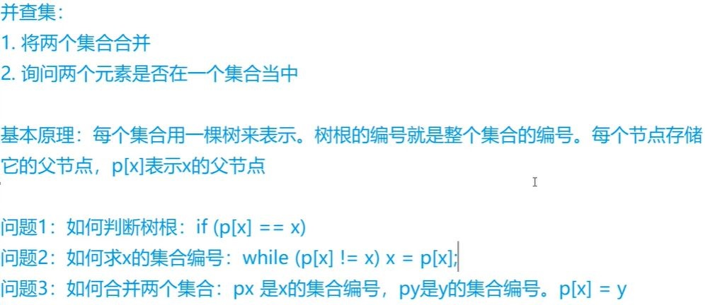
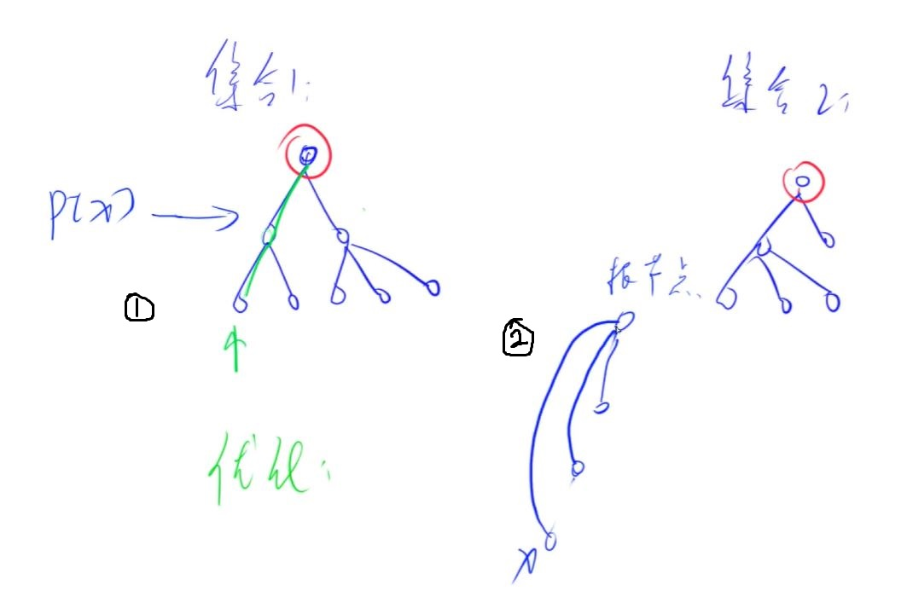

# 并查集
1. 第一步，申请一个数组int[] p, p数组保存每个节点的父节点下标。 如p[i] = j 表示i节点的父节点是j.
2. 初始化： 对所有节点i, 令p[i] = i, 即刚开始所有节点的父节点都是自己。
3. 查找函数find(): 查找一个节点i的祖先节点<br>
如果p[i] == i<br>
则i的祖先就是他自己(=p[i])<br>
否则继续查找p[i]的祖先...一直找到p[i] = i为止
4. 合并两个集合: 给定两个元素i和j， 将这两个元素所属的集合合并为一个集合<br>
将i的祖先的祖先设置为j的祖先即可，这样查找i的祖先元素最终会查找到j的祖先。
p[find(i)] = find[j]




上述的方法是朴素的并查集，对其一个基本的优化是每次查找的时候，都“顺便”把查找路径上的所有点的父元素都
置为祖先元素。这个优化被称为**路径压缩**:



路径压缩的做法:
1. 第一步沿着路径查找某个节点的祖先节点
2. 将这个查找路径上的所有节点的祖先都置为这个祖先节点，这样下次查找这个路径上的任意节点都能直接找到祖先节点，
使得并查集的查找效率降低为近似O(1)</br>

**非路径压缩查找代码**:
```
int find(int i){
    while(p[i]!=i)
        i = p[i];
    return p[i];
}
```
在非路径压缩的查找算法中，我们一路查看i的父节点是否为它自己(p[i]?=i), 如果不是我们往上找(i = p[i])
直到找到p[i] == i， 说明我们找到了祖先节点，这时返回p[i]即可。<br>
非路径压缩查找的代码并没有修改任何元素，因此下一次查找同一个元素的时候，任然要沿着这条路走过相同的查找路径。

**路径压缩查找代码**
```
int find(int i){
    if(p[i]!=i)
        p[i] = find(p[i]);
    return p[i];
}
```
使用递归函数，我们可以将这个路径上所有的p[i]都赋值为找到的那个祖先元素。<br>
这样相当于对这个路径做了压缩，使得这条路径上的所有元素的p都直接指向了这个祖先，
下次查找这条路径上的任意元素都能直接以O(1)的复杂度直接返回祖先元素。

