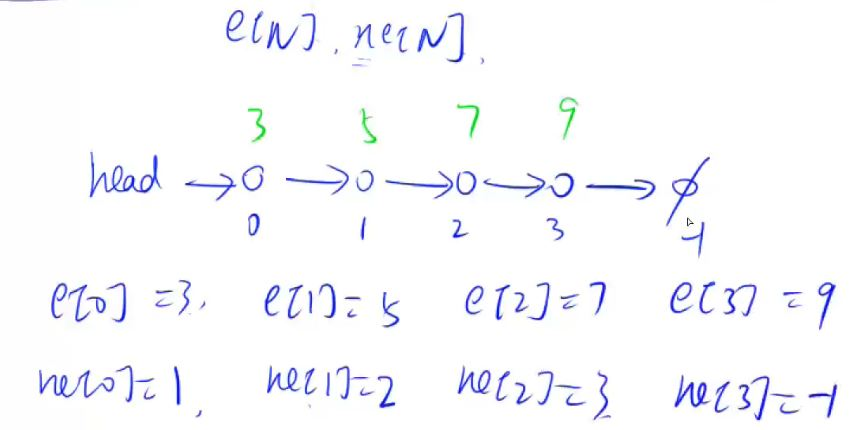

# 数据结构
## 用数组模拟静态单链表
我们子集实现单链表的时候，可以采取定义一个子类，子类有一个成员保存节点的值，一个成员保存指向下
一个节点的指针。这样的链表被成为动态单链表，因为链表的长度随着节点的删除或者添加不断地变化。但是
每次保存节点的时候我们都需要new一个节点出来，而new 操作是非常耗时的。所以在做算法题的时候不推荐。

另外地一种做法是采用数组来模拟单链表，但数组地大小是确定的，且被删除的位置不能被回收再使用，因此用
数组模拟的单链表是静态单链表。但是由于数组存取数据非常的快，因此用数组模拟单链表在算法题中能够节约
时间。并且用数组模拟链表是后面一种重要数据结构的基础--邻接表。邻接表常用来保存稀疏图。在做算法题的
时候，我们经常使用邻接表来保存图和树(树是一种特殊的图。)

用数组模拟单链表的过程如下:
假设单链表最多保存N个元素，
1. 开两个长度为N的数组 e[N] 和ne[N]。e数组保存的是节点的数值，ne数组保存的节点的下个节点的下标，
相当于是一个指针。
2. 定义变量head, head 保存的是头节点的下一个节点的下标。刚开始的时候没有节点，head = -1;



如上图所示，对于每个位置i, e[i]保存的是该节点的值val, ne[i]保存的是该节点的下一个节点的下标next。
以图中的单链表为例，第一个节点保存在0号位置，且它的节点值是3(因此e[0]=3)，它的下一个节点保存在1号
位置(因此ne[0]=1)。我们来到下一个节点，它在1号位置，节点值为5(e[1]=5), 它的下一个节点保存在2号位
置(ne[1]=2),...。如果一个节点没有下一个节点，我们就把它的下一个节点的下标置为-1。如图中3号位置的节
点已经是尾节点，我们把ne[3]置为-1;

我们现在这个链表已经有了三个节点，现在，我想要把一个新的节点(值为10)插入到这个链表中，可以按如下方式操作:
首先，为新的节点分配下标储存信息，图中1，2，3号位置已经用过了，那么我们在4号位置上保存新节点的信
息。首先在4号位置保存新节点的值:e[4] = 10。然后我们可以采用头插法将4号位置的节点插到头节点之后，
可以分两步完成这个操作:
  1. 将4号节点的下一节点指向头节点的下一节点:ne[4] = head;
  2. 将头节点指向4号节点: head = 4;
  
  

经过这样两步，我们实现了把4号节点插入到头节点之后，也就是所谓的头插法。

每次插入新节点的时候我们都需要用一个新的位置来储存新节点的信息(节点值及其下个节点下标)，在由于我们开辟
的是数组，我们可以用一个自动增长的变量idx来表示未使用的下标，idx从0开始，每次被使用就自动往后增长1.

用数组模拟链表，并支持添加节点的代码如下所示:
```
public class 用数组模拟单链表 {
    int N = 100010;
    int[] e = new int[N];//保存节点值
    int[] ne = new int[N];//保存节点的下个节点下标
    int head = -1;
    int idx = 0;//未使用下标标识
    
    //新增一个值为val的节点
    void add_head(int val){
        e[idx] = val;//在新的位置上保存节点值
        ne[idx] = head;//将新节点的next指针指向头节点next指针
        head = idx;//将头节点指向新节点
        idx++;//未使用下标后移一位
    }
}
```
